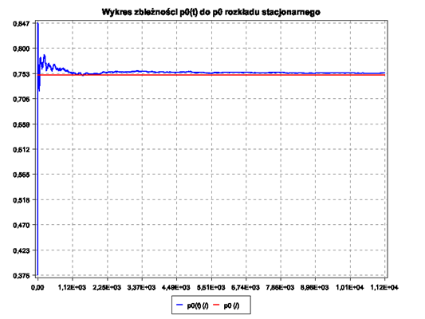
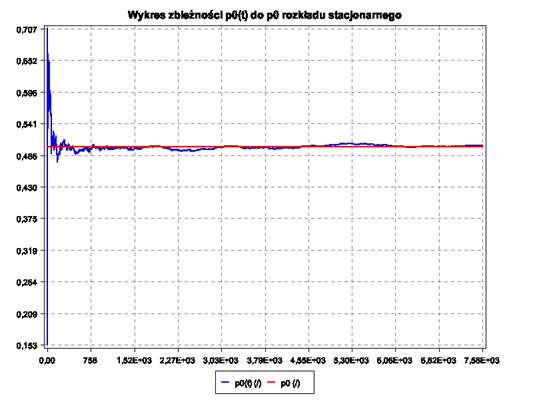
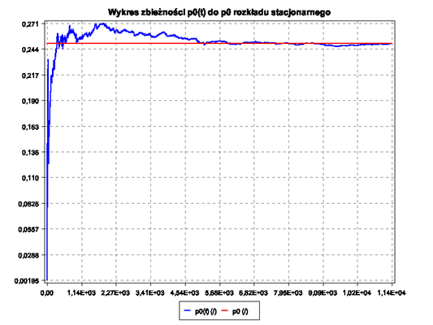

# MM1queue

<h3>Intro</h3>

The aim of the project was to familiarize with the M/M/1 queue, and to implement the event simulator of this queue. The task of such a simulator would be to imitate the M/M/1 queue operation algorithm, and to save the output parameters of the simulation in order to collect system statistics.

  The first part of this project was to simulate a regular M/M/1 queue with various input parameters, and compare these values with the theoretical values of these parameters. After the set of appropriate parameters, it was necessary to plot how the value of the p(0) parameter changed over time, and compare this plot with the plot of the p0 value from the stationary distribution.

  In the second part of the project, it was necessary to modify the queue simulation algorithm so that the server would serve customers all the time. If there are no clients and the buffer is empty, the server would have to deal with imaginary clients, the service time of which would be the same as for real clients. In such a system, the arrival of a "real" customer would not dispossess the "imaginary" customer from service.

<h3>Implementation</h3>

In order to implement the simulation of the regular queue and the M/M/1 continuous service queue, the Java programming language was used. For the implementation of the design task, 6 classes were created:
  
  • Event.class – a class that contains the parameters of each event and stores pointers to the next and previous event.

  • EventList.class – a class containing a pointer to the first element of the list. This class implements the two necessary methods: put() and get(). The put() function puts the newly created event at the end of the list, and the get() method returns the first item in the list and removes it.
  
  • Simulation.class - this class initializes all the necessary parameters for the queue simulation and accepts the input parameters of the simulation. Two necessary methods are defined in this class: the run() method, which runs the simulation and records the statistics, and the exponential() method, which generates an exponential variable.
  
  • Statistics.class – this class inherits from the Simulation.class class, it is done so that the object of this class has access to variables that store information about the final results of the simulation. In this class, methods are defined for calculating various average values that can be compared with analytical values. These methods calculate the average times of the client's stay in the system, taking as input to the function lists into which different times in different states of the system are written. For example, the function "getAvgTimeWaitingForService()", counting the average waiting time for service, takes two lists as arguments: arrivalTimes (list of arrival times of each customer) and startServiceTimes (list of times when the system started serving customers). In order to find the average waiting time for service, you need to: calculate the differences of these times for each item in the list, sum up all these differences and divide by the number of all customers served. This class also implements methods that allow you to display statistics in terminals, save statistics to a file, and a method that generates a plot of convergence p0(t) to p0 from a stationary distribution.
  
  • Plot.class – this class was created to enable the generation of plots using the standard Java AWT graphics library. The source code is open access and can be downloaded from the following link: http://yuriy-g.github.io/simple-java-plot/.
  
  • Main.class – a class that implements the main() method, in which an object of the Statistics class is created. With this object, input values of the simulation are set, and you can run the simulation and display or save statistics and generate a graph.

<h4>The queue operation algorithm is implemented in the run() method and is presented in the following block diagram</h4>

 

<h3>Result plots</h3>

 • ro = 0.25
 • ro = 0.5
 • ro = 0.75

  
  
  
  

